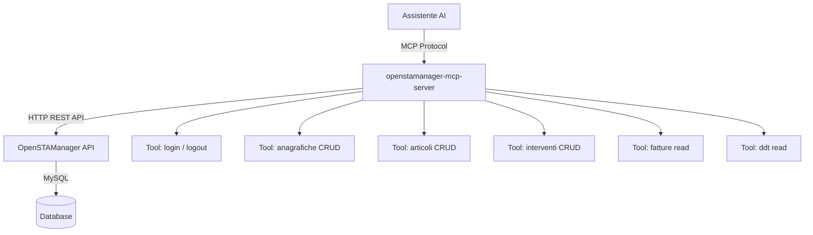

# Piano MCP Server per OpenSTAManager

## Panoramica del Progetto

**OpenSTAManager** è un ERP open-source per la gestione dell'assistenza tecnica e la fatturazione elettronica. Il progetto è basato su PHP/Laravel con un'API REST che supporta operazioni CRUD su varie risorse.

## Obiettivo

Creare un **MCP Server** (Model Context Protocol) in TypeScript/Node.js che permetta agli assistenti AI di interagire con l'API di OpenSTAManager, eseguendo operazioni come:
- Gestione anagrafiche (clienti/fornitori)
- Gestione articoli/prodotti
- Gestione interventi tecnici
- Consultazione fatture e DDT
- Autenticazione e gestione sessioni

---

## Architettura del MCP Server



### Autenticazione API

L'API di OpenSTAManager usa un sistema token-based:
1. `POST /api/?resource=login` con `username` e `password`
2. Il server restituisce un `token`
3. Il token viene passato come parametro `token` in ogni richiesta successiva

---

## Struttura del MCP Server

```
/home/agent/.local/share/Kilo-Code/MCP/openstamanager-server/
├── package.json
├── tsconfig.json
└── src/
    └── index.ts          # Server principale con tutti i tool
```

---

## Tool MCP da Implementare

### Autenticazione
| Tool | Descrizione | Metodo API |
|------|-------------|------------|
| `osm_login` | Effettua login e ottiene token | POST /api/?resource=login |
| `osm_logout` | Effettua logout | POST /api/?resource=logout |

### Anagrafiche (Clienti/Fornitori)
| Tool | Descrizione | Metodo API |
|------|-------------|------------|
| `osm_get_anagrafiche` | Lista anagrafiche con filtri | GET /api/?resource=anagrafiche |
| `osm_create_anagrafica` | Crea nuova anagrafica | POST /api/?resource=anagrafiche |
| `osm_update_anagrafica` | Aggiorna anagrafica esistente | PUT /api/?resource=anagrafiche |
| `osm_delete_anagrafica` | Elimina anagrafica | DELETE /api/?resource=anagrafiche |

### Articoli
| Tool | Descrizione | Metodo API |
|------|-------------|------------|
| `osm_get_articoli` | Lista articoli con filtri | GET /api/?resource=articoli |
| `osm_create_articolo` | Crea nuovo articolo | POST /api/?resource=articoli |
| `osm_update_articolo` | Aggiorna articolo esistente | PUT /api/?resource=articoli |

### Interventi Tecnici
| Tool | Descrizione | Metodo API |
|------|-------------|------------|
| `osm_get_interventi` | Lista interventi con filtri | GET /api/?resource=interventi |
| `osm_create_intervento` | Crea nuovo intervento | POST /api/?resource=interventi |
| `osm_update_intervento` | Aggiorna intervento esistente | PUT /api/?resource=interventi |

### Fatture
| Tool | Descrizione | Metodo API |
|------|-------------|------------|
| `osm_get_fatture` | Lista fatture con filtri | GET /api/?resource=fatture |

### DDT (Documenti di Trasporto)
| Tool | Descrizione | Metodo API |
|------|-------------|------------|
| `osm_get_ddt` | Lista DDT con filtri | GET /api/?resource=ddt |

---

## Configurazione MCP

Il server sarà configurato con le seguenti variabili d'ambiente:

```json
{
  "mcpServers": {
    "openstamanager": {
      "command": "node",
      "args": ["/home/agent/.local/share/Kilo-Code/MCP/openstamanager-server/build/index.js"],
      "env": {
        "OSM_BASE_URL": "http://localhost/openstamanager",
        "OSM_USERNAME": "admin",
        "OSM_PASSWORD": "password"
      },
      "disabled": false,
      "alwaysAllow": [],
      "disabledTools": []
    }
  }
}
```

---

## Passi di Implementazione

1. **Setup progetto** - Creare la struttura del progetto TypeScript con `@modelcontextprotocol/sdk`
2. **Autenticazione** - Implementare login automatico all'avvio e gestione del token
3. **Tool Anagrafiche** - CRUD completo per clienti/fornitori
4. **Tool Articoli** - CRUD per prodotti/articoli
5. **Tool Interventi** - CRUD per interventi tecnici
6. **Tool Fatture** - Lettura fatture
7. **Tool DDT** - Lettura documenti di trasporto
8. **Build** - Compilare TypeScript in JavaScript
9. **Configurazione** - Aggiungere al file MCP settings
