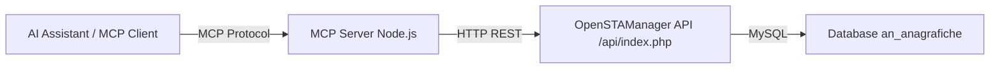

# Piano: MCP Server per OpenSTAManager - Gestione Anagrafiche

## Contesto

OpenSTAManager è un gestionale open-source PHP/Laravel per assistenza tecnica e fatturazione. Espone una REST API legacy su `/api/index.php` che supporta operazioni CRUD sulle anagrafiche (clienti, fornitori, tecnici, ecc.).

### Autenticazione API

L'API legacy usa un token passato nel body JSON come campo `token` (tabella `zz_tokens`):
```json
{ "token": "...", "resource": "anagrafiche", ... }
```

### Endpoint API Anagrafiche

| Operazione | Metodo HTTP | Body/Params |
|---|---|---|
| Lista anagrafiche | GET | `?resource=anagrafiche&token=...` |
| Crea anagrafica | POST | `{"token":"...","resource":"anagrafiche","data":{"ragione_sociale":"...","tipi":[1]}}` |
| Modifica anagrafica | PUT | `{"token":"...","resource":"anagrafiche","data":{"id":1,"ragione_sociale":"..."}}` |
| Elimina anagrafica | DELETE | `{"token":"...","resource":"anagrafiche","id":1}` |

### Campi Anagrafica

Campi principali gestiti dall'API esistente ([`Anagrafiche.php`](modules/anagrafiche/src/API/v1/Anagrafiche.php)):
- `ragione_sociale` (obbligatorio per creazione)
- `tipi` (array di ID tipo anagrafica - obbligatorio per creazione)
- `piva` / `partita_iva`
- `codice_fiscale`
- `indirizzo`, `citta`, `provincia`
- `id_nazione`
- `telefono`, `fax`, `cellulare`
- `email`
- `nome`, `cognome` (per persone fisiche)

---

## Architettura MCP Server

Il server MCP sarà un progetto Node.js/TypeScript standalone nella directory `mcp-openstamanager/`, che comunica con OpenSTAManager tramite la sua REST API.



### Struttura Directory

```
mcp-openstamanager/
├── package.json
├── tsconfig.json
├── .env.example
├── README.md
└── src/
    ├── index.ts          # Entry point MCP server
    ├── config.ts         # Configurazione e variabili ambiente
    ├── osm-client.ts     # Client HTTP per OpenSTAManager API
    └── tools/
        ├── list-anagrafiche.ts
        ├── get-anagrafica.ts
        ├── create-anagrafica.ts
        ├── update-anagrafica.ts
        └── delete-anagrafica.ts
```

---

## Tools MCP da Implementare

### 1. `list_anagrafiche`
- **Descrizione**: Recupera la lista delle anagrafiche con filtri opzionali
- **Input**:
  - `page` (number, opzionale): numero di pagina (default 0)
  - `filter_ragione_sociale` (string, opzionale): filtro per ragione sociale (supporta %)
  - `filter_tipo` (string, opzionale): tipo anagrafica (Cliente, Fornitore, Tecnico, ecc.)
- **Output**: Array di anagrafiche con campi principali + totale record + numero pagine

### 2. `get_anagrafica`
- **Descrizione**: Recupera una singola anagrafica per ID
- **Input**:
  - `id` (number, obbligatorio): ID dell'anagrafica
- **Output**: Dati completi dell'anagrafica

### 3. `create_anagrafica`
- **Descrizione**: Crea una nuova anagrafica
- **Input**:
  - `ragione_sociale` (string, obbligatorio): ragione sociale o nome completo
  - `tipi` (array number, obbligatorio): ID dei tipi anagrafica
  - `nome` (string, opzionale): nome (per persone fisiche)
  - `cognome` (string, opzionale): cognome (per persone fisiche)
  - `piva` (string, opzionale): partita IVA
  - `codice_fiscale` (string, opzionale): codice fiscale
  - `indirizzo` (string, opzionale): indirizzo
  - `citta` (string, opzionale): città
  - `provincia` (string, opzionale): provincia (sigla 2 lettere)
  - `id_nazione` (number, opzionale): ID nazione
  - `telefono` (string, opzionale): telefono
  - `cellulare` (string, opzionale): cellulare
  - `email` (string, opzionale): email
- **Output**: ID della nuova anagrafica creata

### 4. `update_anagrafica`
- **Descrizione**: Modifica un'anagrafica esistente
- **Input**:
  - `id` (number, obbligatorio): ID dell'anagrafica da modificare
  - Tutti i campi di `create_anagrafica` come opzionali
- **Output**: ID dell'anagrafica modificata

### 5. `delete_anagrafica`
- **Descrizione**: Elimina un'anagrafica (soft delete)
- **Input**:
  - `id` (number, obbligatorio): ID dell'anagrafica da eliminare
- **Output**: Conferma eliminazione con ID

---

## Dipendenze

```json
{
  "dependencies": {
    "@modelcontextprotocol/sdk": "^1.0.0",
    "axios": "^1.6.0",
    "zod": "^3.22.0"
  },
  "devDependencies": {
    "typescript": "^5.3.0",
    "@types/node": "^20.0.0",
    "tsx": "^4.0.0"
  }
}
```

---

## Configurazione

Variabili d'ambiente (`.env`):
```env
OSM_BASE_URL=http://localhost/openstamanager
OSM_API_TOKEN=your_api_token_here
```

Il token si ottiene dalla tabella `zz_tokens` del database OpenSTAManager, oppure tramite l'interfaccia utente in Impostazioni > API.

---

## Passi di Implementazione

1. **Creare struttura directory** `mcp-openstamanager/` con `src/` e `src/tools/`
2. **Creare `package.json`** con dipendenze MCP SDK, axios, zod, typescript
3. **Creare `tsconfig.json`** per compilazione TypeScript
4. **Creare `src/config.ts`** per lettura variabili ambiente
5. **Creare `src/osm-client.ts`** con classe client HTTP che wrappa le chiamate all'API OSM
6. **Creare i 5 tool files** in `src/tools/`
7. **Creare `src/index.ts`** come entry point che registra tutti i tool nel server MCP
8. **Creare `.env.example`** con template configurazione
9. **Creare `README.md`** con istruzioni installazione e configurazione

---

## Note Tecniche

- Il server MCP usa il protocollo stdio (standard input/output) per comunicare con il client MCP
- L'autenticazione verso OSM avviene tramite il campo `token` nel body JSON delle richieste
- Il soft delete di OSM usa `deleted_at` (Laravel SoftDeletes), quindi le anagrafiche eliminate non appaiono nelle liste
- I tipi anagrafica (Cliente, Fornitore, Tecnico, Azienda) sono identificati da ID numerici nella tabella `an_tipianagrafiche`
- Per la creazione, il campo `tipi` deve contenere almeno un ID tipo valido
